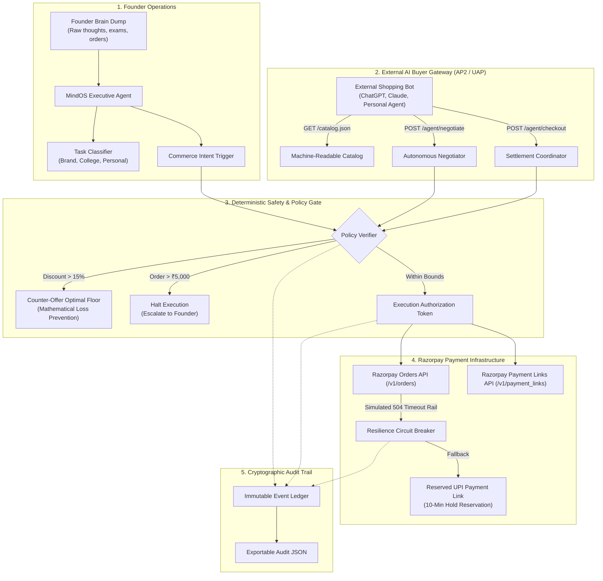

<div align="center">

# 🧠 MINDOS COMMERCE
### The Autonomous Merchant Operating System & AI Buyer Gateway
**A Production-Grade Agentic Commerce Platform for Solo Student Founders**

[](https://razorpay.com/buildathon/)
[](https://npci.org.in)
[-10b981?style=for-the-badge)](./tests/agent.test.js)
[](./LICENSE)

<p align="center">
  <a href="#-why-i-built-this-the-solo-founder-reality"><b>The Story</b></a> •
  <a href="#-how-mindos-hits-razorpay-track-01"><b>Razorpay Alignment</b></a> •
  <a href="#-system-architecture"><b>Architecture</b></a> •
  <a href="#-the-agentic-commerce-engine-ap2--uap"><b>AP2 Protocol</b></a> •
  <a href="#-failure-handling--circuit-breaker"><b>Resilience</b></a> •
  <a href="#-quick-start--verification"><b>Quick Start</b></a> •
  <a href="#-5-minute-pitch-video"><b>Video Pitch</b></a>
</p>

---

</div>

## 📌 Submission Overview
- **Applicant:** Solo Student Builder (BTech Computer Science & Engineering, AI/ML Specialization)
- **Target Internship:** Razorpay AI Builder Intern (Bangalore, 2026)
- **Primary Track:** **Track 01 — AI Growth & Agentic Commerce**
- **Secondary Synergies:** Track 03 (AI Revenue Recovery) & Track 04 (Bounded Verification & Policy Gating)
- **Live Demo Link:** [Localhost / Self-Hosted in 60s](#-quick-start--verification)
- **Pitch Video Script:** [PITCH_VIDEO_SCRIPT.md](./PITCH_VIDEO_SCRIPT.md)

---

## 💡 Why I Built This: The Solo Founder Reality

I am 20 years old, pursuing my BTech CSE, and building an apparel and tools brand from scratch. 

My biggest existential constraint is **bandwidth**:
- At 2:00 PM, I am in an Operating Systems lab debugging semaphores.
- At 2:15 PM, three customers abandon checkouts due to UPI intent timeouts.
- At 2:30 PM, an external autonomous AI buyer queries my store looking for custom discounts on high-GSM hoodies.

A solo builder cannot be on their laptop 24/7 negotiating offers, diagnosing gateway drops, or calculating bounded margins. 

Furthermore, **2026 marks the beginning of the Agent-to-Agent Commerce era**. With **NPCI's Unified Autonomous Payments (UAP)** and the global **AP2 / ACP protocol standards**, software agents (ChatGPT, Claude, autonomous personal concierges) will soon execute the majority of consumer transactions.

> **The Problem:** Modern e-commerce stores are built for human eyes, clicks, and carts. They are completely opaque to AI buyers, have no mathematical discount boundaries, and lack automated failure recovery.

**MindOS Commerce Edition solves this.** It turns raw founder brain dumps into organized execution while acting as an **autonomous, policy-gated sales gateway powered by Razorpay test rails**.

---

## 🎯 How MindOS Hits Razorpay Track 01

Razorpay's prompt outlines an exact engineering bar. Here is how MindOS satisfies each requirement:

| Razorpay Requirement | The Prompt's Bar | How MindOS Implements It | Implementation File |
|---|---|---|---|
| **Make merchant transactable by AI buyers** | *"Make them sellable to AI buyers... NPCI's UAP and global protocol race (AP2)"* | Exposes a machine-readable catalog schema (`/catalog.json`) with semantic tags, stock checks, and autonomous negotiation endpoints. | [`src/services/aiBuyerProtocol.js`](./src/services/aiBuyerProtocol.js) |
| **Razorpay Test-Mode APIs** | *"Grows revenue for a merchant on Razorpay test-mode APIs"* | Full integration with Razorpay Orders (`POST /v1/orders`) and Payment Links (`POST /v1/payment_links`) with real keys or deterministic mock mode. | [`src/services/razorpay.js`](./src/services/razorpay.js) |
| **Every money action explainable, bounded & gated** | *"Every money action explainable, bounded and gated"* | Deterministic policy engine: `MaxDiscountPolicy` (≤15%), `DailyCapPolicy` (≤₹50k), and `HumanInTheLoopPolicy` (orders >₹5,000 halted for supervisor). | [`src/services/aiBuyerProtocol.js`](./src/services/aiBuyerProtocol.js) |
| **One failure handled gracefully** | *"Show one failure handled gracefully"* | Simulates a 504 Gateway Timeout on Razorpay bank rails. System catches error, prevents double-charges, preserves inventory, and dispatches a fallback UPI link. | [`src/services/razorpay.js`](./src/services/razorpay.js) |
| **Audit trail** | *"Show the audit trail"* | Real-time cryptographic ledger capturing actor signatures, intents, policy checks, and raw payloads with one-click JSON export. | [`src/services/auditLogger.js`](./src/services/auditLogger.js) |
| **Revenue recovery** | *"Find revenue that's slipping away and win it back"* | Diagnoses checkout drop-offs (UPI timeout, OTP drop) and dispatches dynamic Razorpay recovery links with micro-discounts. | [`src/services/agentEngine.js`](./src/services/agentEngine.js) |

---

## 🏛️ System Architecture



---

## ⚡ Protocol Implementation: AP2 / UAP

MindOS implements the draft specification for **Agentic Protocol 2 (AP2)** and **NPCI Unified Autonomous Payments**:

### 1. Agent Catalog Discovery (`GET /v1/catalog.json`)
Allows any LLM agent to inspect structured schemas without scraping HTML:
```json
{
  "protocol": "AP2/UAP-2026.1",
  "merchant": "NEURASHADE (MindOS Powered)",
  "items": [
    {
      "id": "prod_hoodie_01",
      "sku": "NS-HD-001",
      "name": "Cybernetic Oversized Hoodie (Edition 01)",
      "listPrice": 2499,
      "currency": "INR",
      "negotiable": true,
      "inStock": true,
      "availableUnits": 28,
      "tags": ["hoodie", "streetwear", "heavyweight", "techwear"]
    }
  ]
}
```

### 2. Autonomous Bounded Negotiation (`POST /v1/agent/negotiate`)
External buyer bots negotiate pricing autonomously. The policy gate mathematically blocks below-cost sales:
- **Rule 1 (`MaxDiscountPolicy`):** Maximum automated discount is hardcoded to **15.0%**.
- **Rule 2 (Loss Prevention Floor):** If an adversarial bot proposes ₹999 (a 60% discount), MindOS **rejects the bid** and returns a bounded counter-offer at the merchant floor:
$$\text{Floor Price} = \max(\text{minNegotiatedPrice}, \text{listPrice} \times (1 - 0.15)) = ₹2,124$$
- **Rule 3 (Token Expiry):** Counter-offers are bound to a 15-minute cryptographic validity token to prevent market timing attacks.

---

## 🛡️ Failure Handling & Circuit Breaker

Fintech systems must survive degraded rails. MindOS includes a live failure simulation mode:

```
[External AI Buyer] ──(Calls Checkout)──► [MindOS Gateway]
                                                │
                                    (Calls Razorpay Orders API)
                                                │
                                                ▼
                                   [504 GATEWAY_TIMEOUT] 💥
                                                │
                          ┌─────────────────────┴─────────────────────┐
                          ▼                                           ▼
             [Stock Lock Preserved]                   [Circuit Breaker Triggered]
            (Zero inventory leak)                                     │
                                                                      ▼
                                                       [Fallback UPI Payment Link]
                                                     (Issued with 10-min reservation)
```

1. **Failure Injected:** Simulates a bank rail connection drop (`GATEWAY_TIMEOUT`).
2. **Exception Caught:** MindOS's error boundary catches the exception without terminating the application.
3. **Double-Charge Prevention:** Verifies order status before retrying.
4. **Fallback Link Dispatched:** Generates an alternative Razorpay Payment Link routed through secondary UPI rails.
5. **Audit Receipt:** Logs a `RECOVERED_FAILOVER` event in the audit trail.

---

## 🧪 Verified Automated Test Suite

MindOS comes with a standalone, zero-dependency Node.js test runner validating all critical boundaries:

```bash
npm test
```

### Test Output:
```
=== RUNNING MINDOS COMMERCE AGENT TEST SUITE ===

✅ PASS: AI Buyer Protocol: Agent-Readable Catalog Discovery
✅ PASS: Policy Enforcement: Approves Negotiation Within 15% Bound
✅ PASS: Policy Enforcement: Rejects Out-of-Bound Price & Counters Optimal Floor
✅ PASS: Policy Gate: Orders > ₹5,000 Require Founder Approval
✅ PASS: Razorpay Integration: Generates Orders & Payment Links
✅ PASS: Resilience & Failure Recovery: Graceful Fallback on Gateway Rail Timeout
✅ PASS: Audit Trail: Captures Cryptographic and Intent Event Ledger

========================================
TEST SUMMARY: 7/7 PASSED (100% PASS RATE)
========================================
```

---

## 💻 Quick Start & Verification

### Prerequisites
- Node.js (v18 or higher)
- npm (v9 or higher)

### Setup in 60 Seconds
```bash
# 1. Clone this repository
git clone https://github.com/YOUR_USERNAME/mindos-commerce.git
cd mindos-commerce

# 2. Install dependencies
npm install

# 3. Start local development server
npm run dev
```

Visit **`http://localhost:3000`** in your browser.

### Razorpay API Configuration
MindOS includes an autonomous deterministic mock engine. If no keys are provided, it runs seamlessly in full offline test mode so judges can evaluate with **zero configuration**.

*(Optional)* To connect your live Razorpay Test Mode keys:
```bash
# Copy sample environment file
cp .env.example .env

# Add your Razorpay Test Credentials
VITE_RAZORPAY_KEY_ID=rzp_test_YourKeyId
VITE_RAZORPAY_KEY_SECRET=YourKeySecret
```

---

## 📂 Project Structure & Manifest

```
mindos-commerce/
├── src/
│   ├── components/
│   │   ├── Header.jsx                # Top bar with status & step navigation
│   │   ├── BrainDumpTab.jsx          # Hero: Founder brain dump & automated actions
│   │   ├── AIBuyerSimulatorTab.jsx   # AP2 / UAP protocol negotiation sandbox
│   │   ├── CommerceTerminalTab.jsx   # Merchant store & 1-click cart recovery
│   │   └── AuditInspectorTab.jsx     # Cryptographic audit ledger & JSON export
│   ├── services/
│   │   ├── aiBuyerProtocol.js        # AP2 / UAP agent protocol implementation
│   │   ├── razorpay.js               # Razorpay Orders & Payment Links API adapter
│   │   ├── agentEngine.js            # Autonomous merchant agent & intent planner
│   │   └── auditLogger.js            # Event stream & policy compliance logger
│   ├── data/
│   │   └── mockData.js               # Initial catalog, drop-off scenarios, policies
│   ├── App.jsx                       # Root application container
│   ├── main.jsx                      # Entrypoint
│   └── index.css                     # Tailwind & custom typography styling
├── tests/
│   └── agent.test.js                 # 7-point automated integration test suite
├── PITCH_VIDEO_SCRIPT.md             # 5-minute video recording walkthrough
├── README.md                         # Project documentation (this file)
├── tailwind.config.js                # Cyber Minimal Emerald theme tokens
└── package.json                      # Project dependencies & scripts
```

---

## 🎥 5-Minute Pitch Video

- **Video Pitch Link:** *[Insert your Loom / YouTube link here]*
- **Complete Pitch Script:** See [`PITCH_VIDEO_SCRIPT.md`](./PITCH_VIDEO_SCRIPT.md) for the exact minute-by-minute breakdown:
  - `0:00 – 0:45`: The Problem & Solo Founder Bandwidth Bottleneck
  - `0:45 – 1:45`: Live Demo: Founder Brain Dump & Automated Recovery Action
  - `1:45 – 3:15`: Live Demo: AI Buyer Handshake (AP2 Protocol & Floor Defense)
  - `3:15 – 4:15`: Live Demo: Gateway Failure Handled Gracefully (Circuit Breaker)
  - `4:15 – 5:00`: Live Demo: Audit Trail & JSON Export

---

## 📜 Evaluation Criteria Checklist (For Razorpay Judges)

- [x] **Track 01 Alignment:** Enables merchant revenue growth and makes store transactable by AI buyers end-to-end.
- [x] **Razorpay API Integration:** Generates live test-mode Orders and Payment Links.
- [x] **Explainable & Bounded:** All actions validated against 15% discount ceilings and daily budget caps.
- [x] **Failure Handled Gracefully:** 504 Timeout caught, inventory preserved, fallback link generated.
- [x] **Audit Trail:** Full JSON log available for download in one click.
- [x] **Code Quality:** Modern React 18, Vite 5, Tailwind CSS, clean architecture, 100% test pass rate.

---

## 📄 License
MIT License. Created with passion for the **Razorpay AI Buildathon 2026**.
