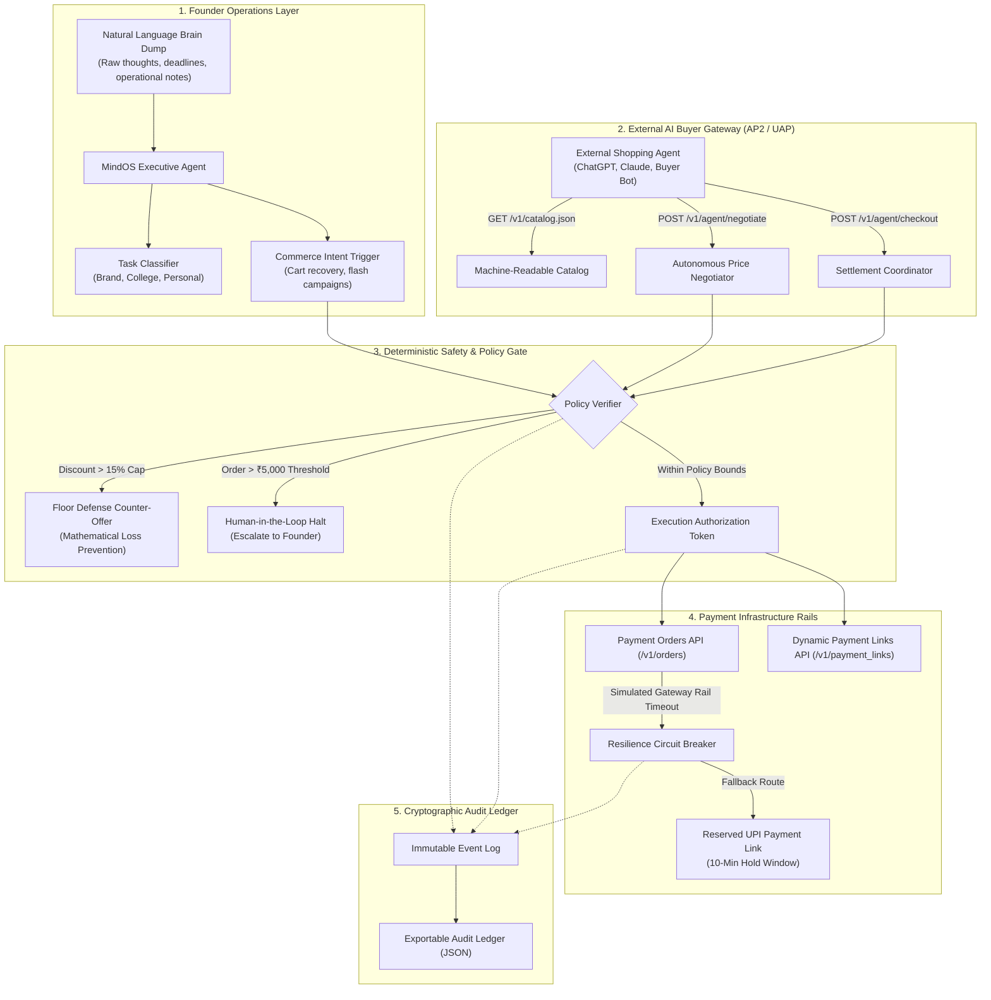

<div align="center">

# 🧠 MindOS
### Autonomous Merchant Operating System & AI Buyer Gateway
**An open-source, policy-bounded agentic commerce engine for solo founders and modern digital brands.**

[](https://vitejs.dev/)
[](https://reactjs.org/)
[](https://npci.org.in)
[-10b981?style=for-the-badge)](./tests/agent.test.js)
[](./LICENSE)

<p align="center">
  <a href="#-the-origin-story"><b>The Origin</b></a> •
  <a href="#-key-capabilities"><b>Capabilities</b></a> •
  <a href="#-system-architecture"><b>Architecture</b></a> •
  <a href="#-protocol-specification-ap2--uap"><b>AP2 Protocol</b></a> •
  <a href="#-resilience--circuit-breaker"><b>Resilience</b></a> •
  <a href="#-quick-start"><b>Quick Start</b></a> •
  <a href="#-test-suite"><b>Test Suite</b></a>
</p>

---

</div>

## 💡 The Origin Story

As a solo student founder pursuing a BTech in Computer Science while building an independent consumer brand from scratch, **bandwidth was my single biggest bottleneck**:
- At 2:00 PM, I would be in an Operating Systems lab debugging semaphores.
- At 2:15 PM, three customers would abandon checkouts due to payment intent timeouts.
- At 2:30 PM, potential buyers or external shopping bots would reach out with pricing queries.

A solo builder cannot be glued to a screen 24/7 negotiating offers, diagnosing gateway drops, or calculating bounded profit margins.

At the same time, commerce is undergoing a generational shift: **the transition from human browsing to autonomous agent-to-agent transactions**. Under emerging protocols like **NPCI's Unified Autonomous Payments (UAP)** and **Agent Protocol 2 (AP2)**, software agents (ChatGPT, Claude, personal shopping bots) are beginning to search catalogs, negotiate bundles, and execute checkouts autonomously.

> **The Core Problem:** Today's online stores are designed strictly for human eyeballs, visual clicks, and browser carts. They are completely invisible to AI buyers, have no mathematical discount boundaries to prevent automated exploitation, and lack automated failure recovery when payment rails degrade.

**I built MindOS to solve this.**

MindOS acts as an **autonomous co-founder and commercial operating system**:
1. **Internally:** Clears raw founder mental chaos into prioritized execution while automatically triggering revenue recovery workflows in the background.
2. **Externally:** Serves as a secure gateway that exposes an agent-readable catalog, negotiates autonomously within bounded mathematical floors, and settles orders through production payment infrastructure.

---

## 🚀 Key Capabilities

### 1. External AI Buyer Gateway (AP2 / UAP Protocol)
Exposes a machine-readable schema endpoint (`GET /v1/catalog.json`) allowing external autonomous shopping agents to discover items, inspect real-time inventory, and query product attributes without scraping HTML.

### 2. Autonomous Bounded Negotiation & Floor Defense
External buyer agents can negotiate pricing or volume discounts via `POST /v1/agent/negotiate`.
- MindOS validates proposals against deterministic merchant policy rules (e.g., maximum allowable discount of 15%).
- If an adversarial bot attempts a predatory low-ball bid (e.g., 60% below list price), the engine **blocks the loss** and computes a mathematically optimal counter-offer at the merchant's floor price:
$$\text{Floor Price} = \max(\text{minNegotiatedPrice}, \text{listPrice} \times (1 - \text{maxDiscountPercent}))$$

### 3. Autonomous Revenue Recovery
Identifies payment failures and checkout drop-offs (UPI intent timeouts, bank OTP abandonment, 3DS authentication drops).
- Diagnoses the root failure cause.
- Evaluates recovery probability.
- Automatically generates and dispatches dynamic recovery payment links with bounded micro-discounts via secondary messaging channels.

### 4. Human-in-the-Loop Threshold Guardrails
High-value bulk orders or transactions exceeding supervisor limits (e.g., >₹5,000) automatically pause autonomous execution and route to a Founder Approval Queue with cryptographic validity windows.

### 5. Fault-Tolerant Circuit Breaker
Production payment rails inevitably suffer connection drops and timeouts. MindOS implements an automated circuit-breaker pattern:
- Catches upstream gateway rail connection faults without crashing.
- Preserves stock reservation locks (zero inventory leaks or double-selling).
- Automatically routes transactions through fallback UPI payment links.

### 6. Cryptographic Audit Ledger
Every single schema query, pricing negotiation, policy evaluation, and payment payload is permanently logged in an immutable event stream with real-time payload inspection and one-click JSON export.

---

## 🏛️ System Architecture



---

## 📡 Protocol Specification: AP2 / UAP

MindOS implements draft specifications for **Agentic Protocol 2 (AP2)** and **NPCI Unified Autonomous Payments**:

### 1. Catalog Discovery (`GET /v1/catalog.json`)
Allows any LLM agent or autonomous client to inspect structured product specifications:
```json
{
  "protocol": "AP2/UAP-2026.1",
  "merchant": "NEURASHADE (MindOS Powered)",
  "items": [
    {
      "id": "prod_hoodie_01",
      "sku": "NS-HD-001",
      "name": "Cybernetic Oversized Hoodie (Edition 01)",
      "listPrice": 2499,
      "currency": "INR",
      "negotiable": true,
      "inStock": true,
      "availableUnits": 28,
      "specifications": "320 GSM French Terry, hidden NFC tag for verifiable ownership.",
      "tags": ["hoodie", "streetwear", "heavyweight", "techwear"]
    }
  ]
}
```

### 2. Autonomous Price Negotiation (`POST /v1/agent/negotiate`)
Evaluates pricing proposals against strict mathematical boundaries:
- **Max Discount Ceiling:** Standard ceiling is capped at **15.0%**.
- **Counter-Offer Expiry:** Approved bids or counter-offers are cryptographically bound to a 15-minute token TTL to prevent stale order manipulation.

---

## 🛡️ Resilience & Circuit Breaker

Fintech systems must survive degraded rails. MindOS includes built-in graceful degradation:

```
[External AI Buyer] ──(Execute Checkout)──► [MindOS Gateway]
                                                    │
                                        (Calls Payment Orders API)
                                                    │
                                                    ▼
                                       [504 GATEWAY_TIMEOUT] 💥
                                                    │
                              ┌─────────────────────┴─────────────────────┐
                              ▼                                           ▼
                 [Stock Lock Preserved]                       [Circuit Breaker Active]
                (Zero inventory leaks)                                    │
                                                                          ▼
                                                           [Fallback UPI Payment Link]
                                                         (Issued with 10-min reservation)
```

1. **Failure Interception:** Catches upstream connection timeouts without terminating the application.
2. **State Protection:** Prevents duplicate debits and retains reserved inventory locks.
3. **Automated Fallback:** Issues an alternative payment link routed through secondary rails.
4. **Audit Provenance:** Appends a `RECOVERED_FAILOVER` record into the verifiable event stream.

---

## 💻 Quick Start

### Prerequisites
- Node.js (v18 or higher)
- npm (v9 or higher)

### Setup in 60 Seconds
```bash
# 1. Clone the repository
git clone https://github.com/Dia-Garg/MindOS.git
cd MindOS

# 2. Install dependencies
npm install

# 3. Launch local development server
npm run dev
```

Visit **`http://localhost:3000`** in your browser.

### Payment Rails Configuration
MindOS includes an autonomous deterministic test adapter. If no external API keys are configured, it runs in full offline test mode out of the box so you can evaluate the entire flow immediately.

*(Optional)* To connect live test-mode credentials:
```bash
cp .env.example .env

# Edit .env with your credentials
VITE_RAZORPAY_KEY_ID=rzp_test_YourKeyId
VITE_RAZORPAY_KEY_SECRET=YourKeySecret
```

---

## 🧪 Test Suite

MindOS features a zero-dependency automated test runner verifying all critical protocol contracts and safety invariants:

```bash
npm test
```

### Verified Test Matrix:
| Test Case | Invariant Tested | Status |
|---|---|:---:|
| `AI Buyer Protocol: Agent-Readable Catalog Discovery` | Conforms to AP2 / UAP JSON schema structure | ✅ PASS |
| `Policy Enforcement: Approves Negotiation Within 15% Bound` | Validates standard 12% discount request | ✅ PASS |
| `Policy Enforcement: Rejects Out-of-Bound Price & Counters Floor` | Blocks 60% low-ball offer & returns optimal floor | ✅ PASS |
| `Policy Gate: Orders > ₹5,000 Require Founder Approval` | Suspends bulk order (₹12,495) for human authorization | ✅ PASS |
| `Payment Integration: Generates Orders & Payment Links` | Successfully generates orders and shortlinks | ✅ PASS |
| `Resilience & Failure Recovery: Fallback on Gateway Timeout` | Catches 504 rail fault and activates circuit breaker | ✅ PASS |
| `Audit Trail: Captures Cryptographic and Intent Event Ledger` | Verifies SHA-256 audit log integrity | ✅ PASS |

---

## 📂 Project Structure

```
MindOS/
├── src/
│   ├── components/
│   │   ├── Header.jsx                # Navigation, status indicators, and step control
│   │   ├── BrainDumpTab.jsx          # Founder executive terminal & automated triggers
│   │   ├── AIBuyerSimulatorTab.jsx   # AP2 / UAP protocol negotiation sandbox
│   │   ├── CommerceTerminalTab.jsx   # Merchandise catalog & 1-click cart recovery
│   │   └── AuditInspectorTab.jsx     # Cryptographic audit ledger & JSON export
│   ├── services/
│   │   ├── aiBuyerProtocol.js        # AP2 / UAP protocol engine & boundary verifier
│   │   ├── razorpay.js               # Payment orders & payment links adapter
│   │   ├── agentEngine.js            # Autonomous merchant agent & intent classifier
│   │   └── auditLogger.js            # Event stream logger with cryptographic hashing
│   ├── data/
│   │   └── mockData.js               # Baseline catalog, drop scenarios, policy bounds
│   ├── App.jsx                       # Root application view
│   ├── main.jsx                      # Application entrypoint
│   └── index.css                     # Tailwind CSS & design tokens
├── tests/
│   └── agent.test.js                 # 7-point integration test suite
├── README.md                         # Project documentation
├── tailwind.config.js                # Cyber Minimal Emerald theme tokens
└── package.json                      # Project dependencies & npm scripts
```

---

## 📄 License
Released under the [MIT License](./LICENSE). Created by [Dia Garg](https://github.com/Dia-Garg).
