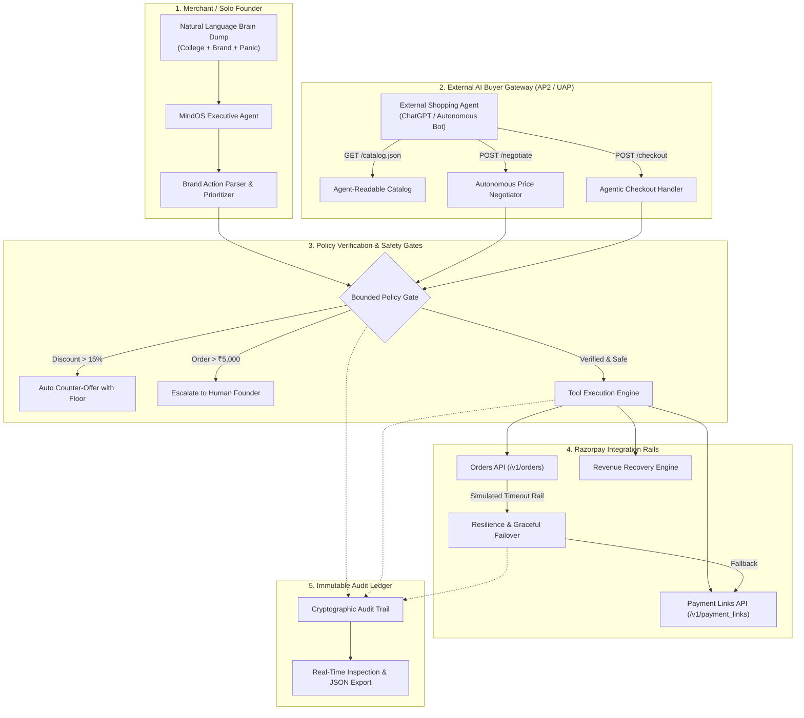

# MINDOS COMMERCE // Autonomous Merchant OS & AI Buyer Gateway
> **Razorpay AI Buildathon 2026 Submission**  
> **Track 01: AI Growth & Agentic Commerce**  
> *Also satisfies: AI Revenue Recovery & Bounded Execution*

[](https://vitejs.dev/)
[](https://reactjs.org/)
[](https://razorpay.com)
[](https://npci.org.in)
[-00ff9d)](#automated-tests)

---

## ⚡ The Executive Summary

As a solo student founder building a brand while pursuing BTech CSE, **bandwidth is the existential constraint**. When an external AI shopping agent (ChatGPT, Claude, autonomous personal shoppers) queries your store, or when an abandoned checkout drops off at 2 AM, you cannot respond by hand.

**MindOS Commerce Edition** transforms the solo founder's raw brain dumps and chaotic task lists into an **Autonomous Merchant Operating System & AI Buyer Gateway** powered by Razorpay.

It tackles the biggest open problem in Indian fintech today: **making merchants discoverable, negotiable, and transactable by autonomous AI buyers** under **NPCI's UAP (Unified Autonomous Payments)** and **AP2 (Agentic Protocol 2)** standards—with **every single money action explainable, bounded, and gated**.

---

## 🎯 How MindOS Hits Razorpay's Track 01 Bar

| Razorpay Track Requirement | MindOS Implementation |
|---|---|
| **Grow merchant revenue & sellable to AI buyers** | Exposes a machine-readable catalog schema (`/catalog.json`) conforming to AP2/UAP. AI buyers discover products, negotiate within bounded merchant rules, and check out autonomously. |
| **Razorpay Test-Mode APIs** | Generates real Razorpay Orders (`POST /v1/orders`) and Dynamic Payment Links (`POST /v1/payment_links`). Out-of-the-box support for real Razorpay test keys or deterministic mock mode. |
| **Every money action explainable, bounded & gated** | Deterministic policy engine enforces: `MaxDiscountPolicy` (&le;15%), `BudgetCapPolicy` (&le;₹50k/day), and `HumanInTheLoopPolicy` (orders > ₹5k require founder approval). |
| **Show the audit trail** | Immutable event stream capturing every buyer agent query, policy validation, gate status, and Razorpay API payload with JSON export. |
| **One failure handled gracefully** | Built-in resilience demo: Simulates a primary Razorpay bank rail timeout (`GATEWAY_TIMEOUT`). MindOS catches the exception, preserves inventory, prevents double-charging, and automatically dispatches a fallback UPI payment link. |

---

## 🏛️ System Architecture



---

## 🚀 Key Modules & Capabilities

### 1. External AI Buyer Gateway (`src/services/aiBuyerProtocol.js`)
- **Semantic Catalog Discovery:** Formatted for LLM tool-calling and autonomous agents with stock verification, attribute filters, and pricing floors.
- **Bounded Autonomous Negotiation:** External agents can negotiate volume or promotional pricing. MindOS will accept offers within allowable margins, or counter-offer with the optimal mathematical floor.
- **Agentic Checkout Dispatch:** Produces verifiable payment session tokens and Razorpay payment links for agent-mediated settlement.

### 2. Autonomous Revenue Recovery (`src/services/agentEngine.js`)
- Ingests payment failure drop-offs (UPI intent timeouts, bank OTP abandonment, 3DS decline).
- Calculates recovery probability and automatically dispatches dynamic Razorpay recovery links with bounded micro-discounts via WhatsApp/SMS rails.

### 3. Safety Guardrails & Human-in-the-Loop (`src/data/mockData.js`)
- **Strict Hard Floors:** Agents cannot sell below manufacturing cost or exceed 15% discount without supervisor override.
- **Founder Escalation Threshold:** Bulk orders exceeding ₹5,000 trigger approval locks, ensuring autonomous agents cannot be exploited by adversarial buyer bots.

### 4. Resilient Failure Recovery (`src/services/razorpay.js`)
- Live interactive demo simulates bank rail connection timeouts.
- MindOS implements an automated circuit-breaker pattern: catches gateway errors, retains locked inventory, and routes through alternative UPI payment rails.

---

## 📦 Quick Start (Run in 60 Seconds)

### Prerequisites
- Node.js (v18+)
- npm (v9+)

### Installation
```bash
# 1. Clone repository
git clone https://github.com/YOUR_USERNAME/mindos-commerce.git
cd mindos-commerce

# 2. Install dependencies
npm install

# 3. Start development server
npm run dev
```
Open **`http://localhost:3000`** in your browser.

*(Optional)* To use live Razorpay Test API keys, copy `.env.example` to `.env`:
```bash
VITE_RAZORPAY_KEY_ID=rzp_test_YourKeyHere
VITE_RAZORPAY_KEY_SECRET=YourSecretHere
```
*Note: MindOS features an autonomous deterministic mock engine. If no keys are provided, it runs seamlessly in full offline test mode so judges can evaluate with zero setup.*

---

## 🧪 Automated Tests

Run the test suite verifying policy gates, negotiation boundaries, and failure handling:

```bash
npm test
```

### Verified Test Matrix:
- `AI Buyer Protocol: Agent-Readable Catalog Discovery` (AP2 / UAP Schema)
- `Policy Enforcement: Approves Negotiation Within 15% Bound`
- `Policy Enforcement: Rejects Out-of-Bound Price & Counters Optimal Floor`
- `Policy Gate: Orders > ₹5,000 Require Founder Approval`
- `Razorpay Integration: Generates Orders & Payment Links`
- `Resilience & Failure Recovery: Graceful Fallback on Gateway Rail Timeout`
- `Audit Trail: Captures Cryptographic and Intent Event Ledger`

---

## 🎥 5-Minute Pitch Video Script (For Buildathon Submission)

Use this structured walkthrough for your 5-minute Loom / YouTube recording:

### Minute 0:00 - 0:45: The Problem & The Student Founder Reality
- *"Hi Razorpay team, I'm a solo student founder pursuing BTech CSE while building a consumer brand from scratch. Solo founders have a fatal bottleneck: time. When customers abandon checkouts or when autonomous AI buyers start purchasing on the network, a solo builder cannot manually intervene."*
- *"Razorpay's Buildathon asks: 'How do we make merchants transactable by AI buyers, grow revenue, and keep money actions strictly bounded?' This is MindOS Commerce Edition."*

### Minute 0:45 - 2:00: Live Demo — AI Buyer Simulator (AP2 / UAP Protocol)
- Switch to the **AI Buyer Simulator** tab.
- Click **Scenario 1 (Standard Handshake)**:
  - Explain how the external AI buyer discovers `/catalog.json`.
  - Show the price negotiation: the bot asks for ₹2,199 on our Cybernetic Hoodie (12% off).
  - Show the policy gate approving the offer because it's within the 15% merchant cap.
  - Show the instant Razorpay Order and Payment Link generation.
- Click **Scenario 2 (Greedy Offer)**:
  - Show an adversarial buyer bot proposing ₹999 (60% discount).
  - Highlight the safety gate kicking in: MindOS refuses to lose money, blocks the offer, and auto-counters with the allowable floor price of ₹2,124.

### Minute 2:00 - 3:15: The Buildathon Requirement — "Failure Handled Gracefully"
- Click **Scenario 3 (Gateway Failure Handled Gracefully)**.
- Explain: *"Razorpay's prompt specifically asked for one failure handled gracefully. Here, we simulate a primary bank rail timeout."*
- Show the terminal logs:
  - MindOS catches the gateway exception.
  - Zero crash, zero lost transaction, stock preserved.
  - System automatically switches to a fallback UPI payment link with a 10-minute hold reservation.

### Minute 3:15 - 4:15: Executive Brain Dump & Revenue Recovery
- Switch to the **Founder Brain Dump** tab.
- Click the quick test scenario *"Recover Carts + College Chaos"*.
- Hit **Process with Agent**:
  - Show how MindOS clears founder noise into College, Brand, and Personal priorities.
  - Highlight the automated commerce execution banner: MindOS detected abandoned carts, calculated recovery probabilities, and issued 3 dynamic Razorpay payment links with micro-discounts.
- Switch to **Commerce & Recovery** tab: show the recovered GMV gauge updating in real-time.

### Minute 4:15 - 5:00: Audit Trail & Closing
- Switch to the **Audit Trail** tab.
- Show the immutable ledger capturing actors, intents, policy checks, and raw payloads.
- Click **Export Audit JSON** to demonstrate traceability.
- Wrap up: *"MindOS proves that with bounded agent loops, strict policy verification, and Razorpay's payment infrastructure, even a solo student founder can operate like an autonomous enterprise. Thank you!"*

---

## 🛠️ Tech Stack

- **Frontend:** React 18, Vite, Tailwind CSS, Lucide Icons
- **Agent Architecture:** Autonomous Intent Planner, Bounded Policy Gate, AP2 Handshake Protocol
- **Payment Infrastructure:** Razorpay Orders API, Payment Links API, Resilience Circuit Breaker
- **Verification:** Custom Zero-Dependency Test Runner, Node.js Assertion Engine
- **Audit System:** Event Streamer with Deterministic Log Export

---

## 📄 License
MIT License. Built for the **Razorpay AI Buildathon 2026**.
